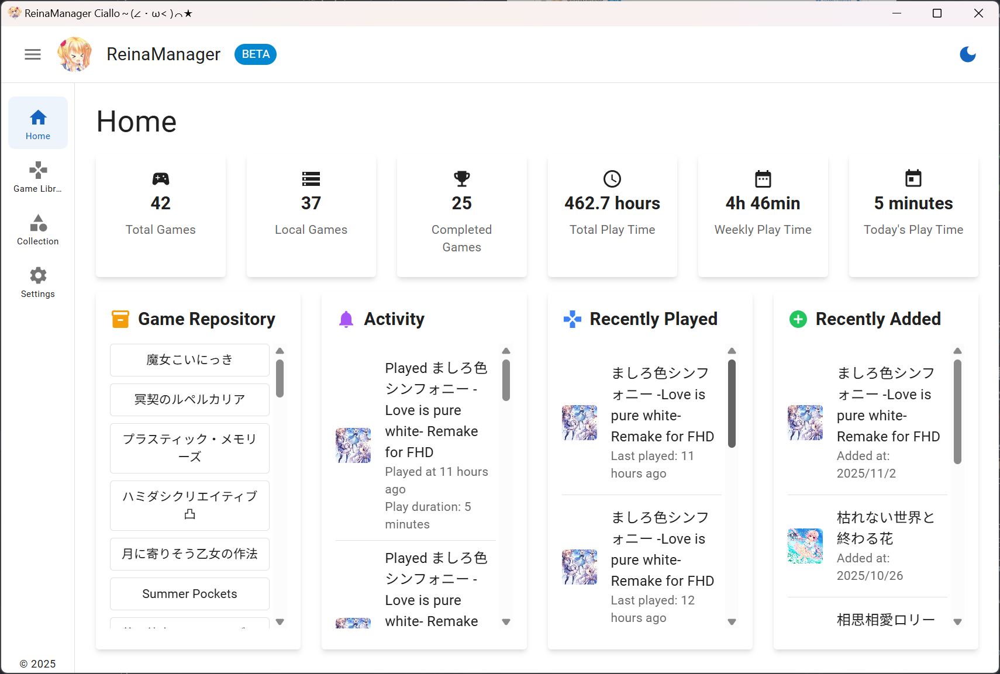
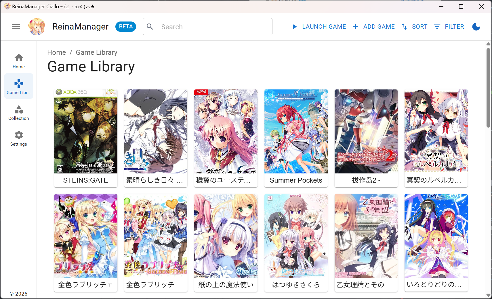
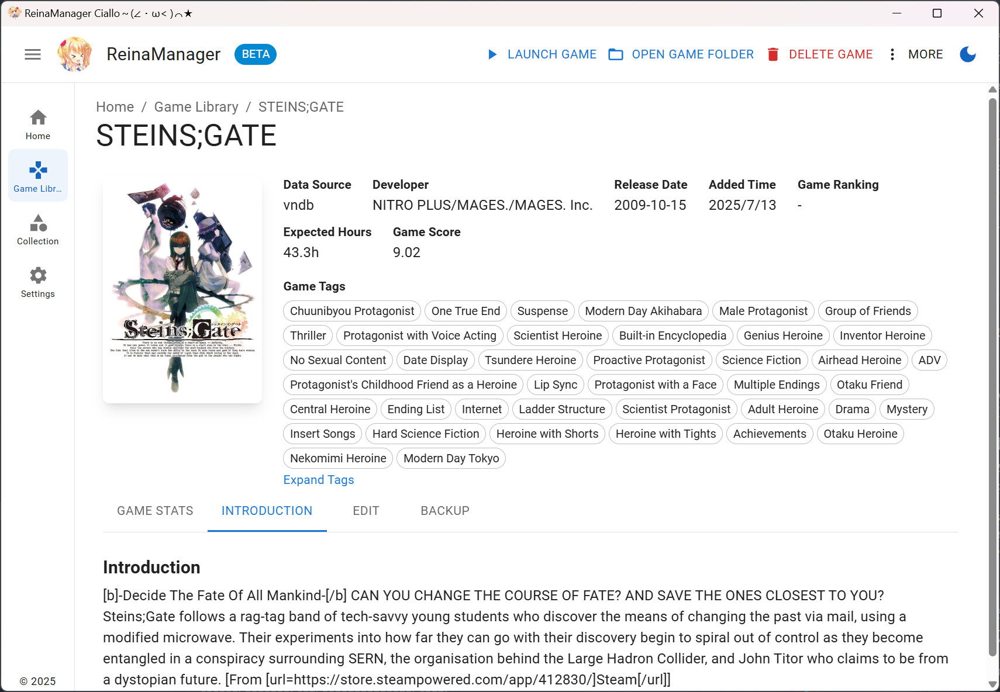
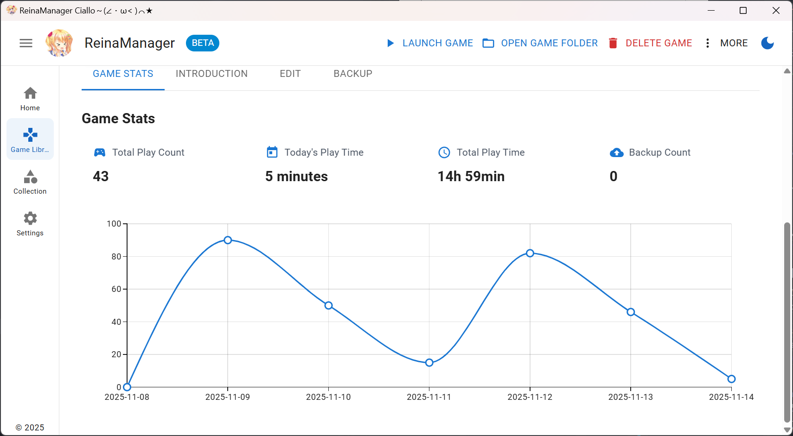
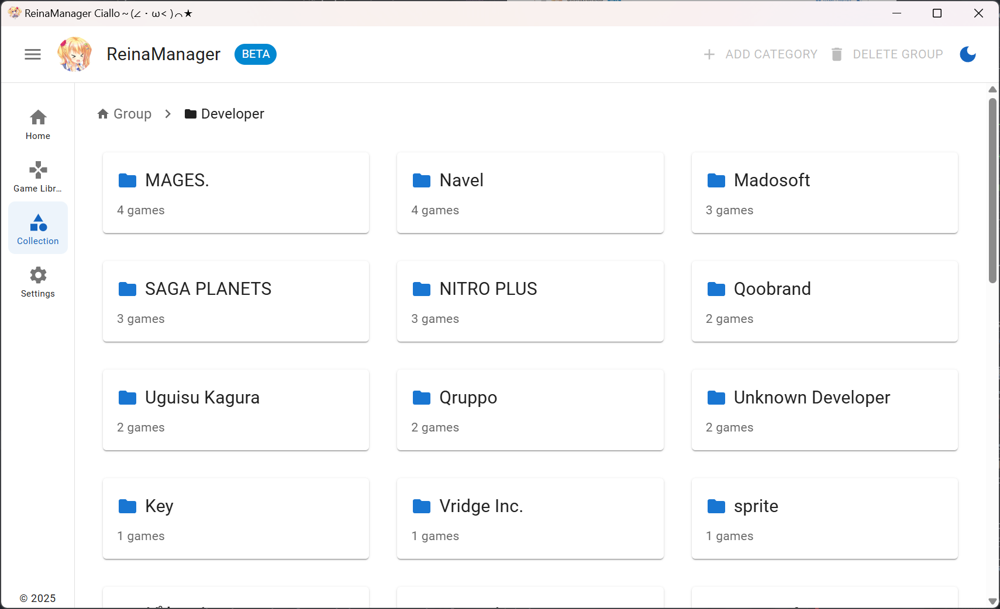
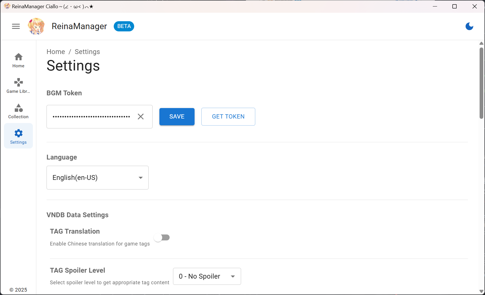

<div align="center">
  <div style="width:200px">
    <a href="https://vndb.org/c64303">
      
    </a>
  </div>

<h1>ReinaManager</h1>

    

[](https://wakatime.com/badge/user/36a51c62-bf3b-4b81-9993-0e5b0e7ed309/project/efb3bd00-20c2-40de-98b6-e2f4a24bc120)

开发时间统计自 v0.9.0 版本起

<p align="center"><a href="./README.md">English</a>|中文|<a href="./README.zh_TW.md">繁體中文</a>|<a href="./README.ja_JP.md">日本語</a></p>

<h5>一个轻量级的galgame/视觉小说管理工具，正在开发中...</h5>

名称中的 `Reina` 来源于游戏 <a href="https://vndb.org/v21852"><b>金色ラブリッチェ(Kin'iro Loveriche)</b></a> 中的角色 <a href="https://vndb.org/c64303"><b>妃 玲奈(Kisaki Reina)</b></a>

</div>

## Linux 分支注释

本分支为适配中的linux分支，完整功能参考release的变更日志，下列文档可能不准确，仅供参考：

- [x] 启动管理功能依赖于`systemd`(version>=211)下`systemd-run`可执行文，及[org.freedesktop.systemd1 — The D-Bus interface of systemd](https://www.freedesktop.org/software/systemd/man/latest/org.freedesktop.systemd1.html)接口。
      使用可配置的启动脚本启动游戏，默认为`wine`（推荐使用[umu-launcher](https://github.com/Open-Wine-Components/umu-launcher)结合（各版本）[Proton](https://github.com/ValveSoftware/Proton)）
- [x] 使用xcb监控x11（含xwaylnad）启动的游戏的窗口，包括聚焦时间
- [x] 设置中的开机自启，请确保桌面环境支持[XDG Autostart specification](https://specifications.freedesktop.org/autostart/latest/)
- [x] 桌面托盘tray
- [x] 增加了一个扫描游戏库功能
- [ ] wayland下的游戏窗口和聚焦监控


合并前请自行构建或参见如下：


### Debian Ubuntu RedHat

参考[release](https://github.com/wind-mask/ReinaManager/releases/)中的`deb`和`rpm`构建


### 一般Linux
⚠️!注意：AppImage的原生wayland不可用，必须有X兼容环境（如xwayland）

参考[release](https://github.com/wind-mask/ReinaManager/releases/)中的`AppImage`构建

## 技术栈

- Tauri 2.0

- React

- Material UI

- UnoCSS

- Zustand

- TanStack Query

- Sqlite

- Rust

- SeaORM

## 功能特性

- 🌐 **Multi-source Data Integration** - Seamlessly fetch and merge game metadata from VNDB, Bangumi and YmGal APIs
- 🔍 **Powerful Search** - Smart search game from titles, aliases, custom names, and other metadata
- 📚 **Collection Management** - Organize games with hierarchical groups and categories for better library management, support drag and drop sorting
- 🎮 **Play Time Tracking** - Automatic gameplay session recording with detailed play time statistics and history
- 🎨 **Customization** - Set custom metadata for games such as covers, names, tags, etc., to create a personalized game library
- 🔄 **Batch Operations** - Bulk import, add and update game metadata from APIs 
- 🌍 **Multi-language Support** - Complete i18n support with multiple language interfaces, including Chinese (Simplified, Traditional), English, Japanese, etc.
- 🔒 **NSFW Filter** - Hide or cover NSFW content with a simple toggle
- 💾 **Auto Savedata Backup** - Configurable automatic backup to protect your game savedata
- 🚀 **System Integration** - Auto-start on boot and minimize to system tray
- 🎮 **Tool Integration** - Launch games with LE locale switching and Magpie upscaling integration

## 待办事项

- [x] Bulk import games from folders
- [x] Basic support for the Linux platform
- [ ] Beautify individual pages
- [ ] Sync game status with Bangumi and VNDB

## 迁移

需要从其他 galgame/视觉小说管理器迁移数据？请查看 [reina_migrator](https://github.com/huoshen80/reina_migrator) - 一个用于将其他管理器数据迁移到 ReinaManager 的工具。

当前支持：
- **WhiteCloud** 数据迁移

该迁移工具可帮助您无缝转移游戏库、游玩时间记录和其他数据到 ReinaManager。

## 展示

##### 前端展示
- 网页版本：[https://reina.huoshen80.top](https://reina.huoshen80.top)
- 网页版功能尚未完全实现，但您可以查看界面和部分功能。

##### 桌面应用展示








更多内容，你可以下载最新的发布版本：[下载](https://github.com/huoshen80/ReinaManager/releases)

## 贡献
##### 开始
欢迎任何形式的贡献！如果你有改进建议、发现了 bug，或希望提交 Pull Request，请按照以下步骤操作：

1. Fork 本仓库，并从 `main` 分支创建新分支。
2. 如果修复了 bug 或新增了功能，请尽量进行相应测试。
3. 保证代码风格与现有代码一致，并通过所有检查。
4. 提交 Pull Request，并清晰描述你的更改内容。

##### 本地构建与运行项目
1. 确保你已安装 [Node.js](https://nodejs.org/) 和 [Rust](https://www.rust-lang.org/)。
2. 克隆仓库：
   ```bash
   git clone https://github.com/huoshen80/ReinaManager.git
   cd ReinaManager
   ```
3. 安装依赖：
   ```bash
   pnpm install
   ```
4. 运行开发服务器：
   ```bash
   pnpm tauri dev
   ```
5. 构建生产版本：
   ```bash
   pnpm tauri build
   ```

感谢你为 ReinaManager 做出的所有贡献！

## 赞助
如果你觉得这个项目好用，并希望支持项目的开发，可以考虑赞助。非常感谢每个支持者！
- [Sponsor link](https://cdn.huoshen80.top/233.html)

## 数据源

- **[Bangumi](https://bangumi.tv/)** - Bangumi 番组计划

- **[VNDB](https://vndb.org/)** - 视觉小说数据库

- **[Ymgal](https://www.ymgal.games/)** - 月幕Galgame

特别感谢这些平台提供的公共 API 和数据！

## 许可证

本项目采用 [AGPL-3.0 许可证](https://github.com/huoshen80/ReinaManager#AGPL-3.0-1-ov-file)

## Star 历史

[](https://star-history.com/#huoshen80/ReinaManager&Date)