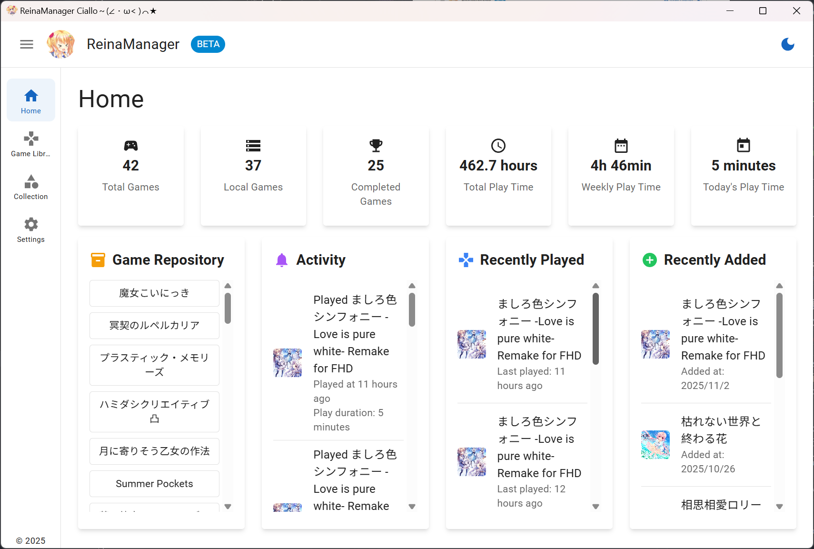
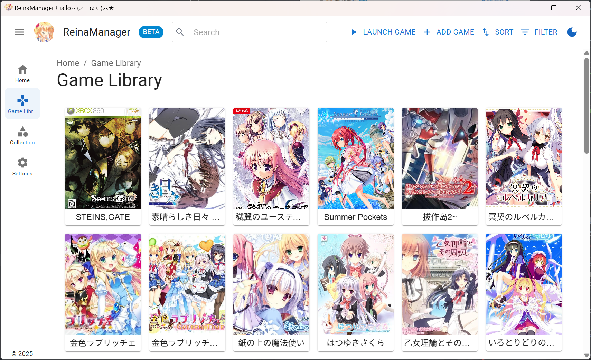
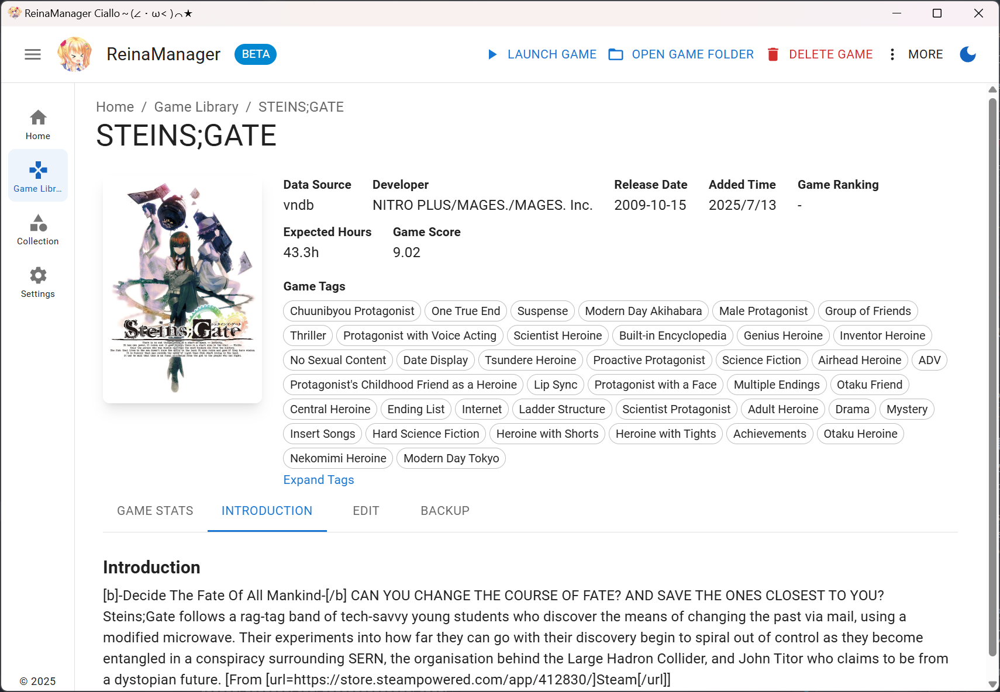
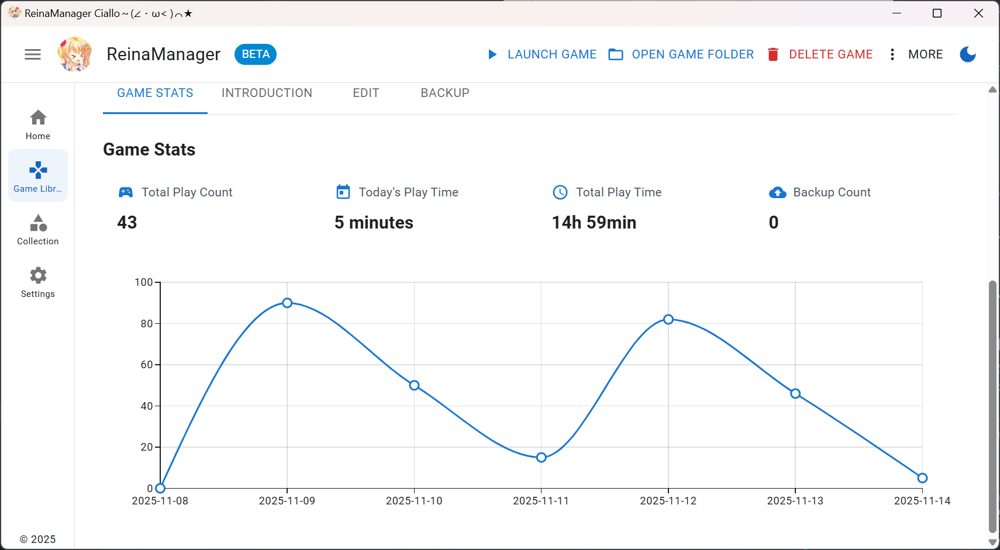
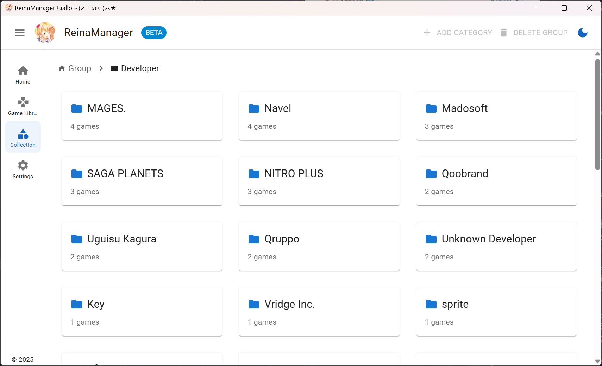

<div align="center">
  <div style="width:200px">
    <a href="https://vndb.org/c64303">
      
    </a>
  </div>

<h1>ReinaManager</h1>

    

[](https://qm.qq.com/cgi-bin/qm/qr?_wv=1027&k=KHB4Pm2fmtyWv3OklLNxDxkjIKtiwMBj&authKey=2KeSnTCv%2By6ORWuEOYEZx9q63pRrCKkQRK8VqpaOiGZUS1zZ%2BNVmCbRkN3F2lpc7&noverify=0&group_code=556984160) [](https://wakatime.com/badge/user/36a51c62-bf3b-4b81-9993-0e5b0e7ed309/project/efb3bd00-20c2-40de-98b6-e2f4a24bc120)

開發時間統計自 v0.9.0 版本起

<p align="center"><a href="./README.md">English</a>|<a href="./README.zh_CN.md">中文</a>|繁體中文|<a href="./README.ja_JP.md">日本語</a></p>

<h5>一個輕量級的galgame/視覺小說管理工具，正在開發中...</h5>

名稱中的 `Reina` 來源於遊戲 <a href="https://vndb.org/v21852"><b>金色ラブリッチェ(Kin'iro Loveriche)</b></a> 中的角色 <a href="https://vndb.org/c64303"><b>妃 玲奈(Kisaki Reina)</b></a>

</div>

## 技術棧

- Tauri 2.0

- React

- Material UI

- UnoCSS

- Zustand

- TanStack Query

- Sqlite

- Rust

- SeaORM

## 功能特性

- 🌐 **多源數據整合** - 無縫獲取並合併多個來源 API 的遊戲元數據
- 🔍 **強大的搜尋** - 透過遊戲標題、別名、自訂名稱及其他資訊快速搜尋遊戲
- 🗂️ **篩選排序** - 對遊戲進行多維度的篩選和排序，如按來源、狀態、標籤等
- 📚 **收藏管理** - 透過分組和分類組織遊戲庫，並支援拖曳排序
- 🎮 **遊戲時長追蹤** - 自動記錄遊戲會話，提供詳細的遊玩時間統計和歷史記錄
- 🎨 **個性化定制** - 支援自訂遊戲封面、名稱、簡介、標籤等資訊，打造專屬遊戲庫
- 🔄 **批量操作** - 支援從 API 批量匯入、添加和更新遊戲元數據
- 🌍 **多語言支持** - 提供完整的國際化支持，包含簡體中文、繁體中文、英文、日文等語言
- 🔒 **NSFW 過濾** - 通過簡單的開關隱藏或遮蓋 NSFW 內容
- 💾 **存檔備份** - 支援手動和自動備份遊戲存檔
- 🚀 **系統集成** - 開機自啟動和最小化到系統托盤
- 🛠️ **工具整合** - 啟動遊戲可聯動 Locale Emulator 轉區和 Magpie 放大

## 待辦事項

- [x] 從資料夾批量匯入遊戲
- [x] 對 Linux 平台的基礎支持
- [x] 與 Bangumi 和 VNDB 同步遊戲狀態
- [ ] 美化各個頁面

## 遷移

需要從其他 galgame/視覺小說管理器遷移數據？請查看 [reina_migrator](https://github.com/huoshen80/reina_migrator) - 一個用於將其他管理器數據遷移到 ReinaManager 的工具。

當前支持：

- **WhiteCloud v0.4.0** 數據遷移

該遷移工具可幫助您無縫轉移遊戲庫、遊玩時間記錄和其他數據到 ReinaManager。

## 截圖







更多資訊，您可以下載最新的發布版本：[下載](https://github.com/huoshen80/ReinaManager/releases)

## 貢獻

##### 開始

歡迎各種形式的貢獻！如果你有改進建議、發現了 bug，或想提交 Pull Request，請依照以下步驟：

1. Fork 本倉庫，並從 `main` 分支建立新分支。
2. 若修復了 bug 或新增功能，請盡量進行相關測試（本專案使用 Biome 格式化和檢查程式碼）。
3. 請確保程式碼風格與現有代碼一致，並通過所有檢查。
4. 提交 Pull Request，並清楚描述你的更改內容。

##### 本機建構與執行專案

1. 確保已安裝 [Node.js](https://nodejs.org/) 及 [Rust](https://www.rust-lang.org/)。
2. Clone 倉庫：
   ```bash
   git clone https://github.com/huoshen80/ReinaManager.git
   cd ReinaManager
   ```
3. 安裝依賴：
   ```bash
   pnpm install
   ```
4. 啟動開發伺服器：
   ```bash
   pnpm tauri dev
   ```
5. 建構生產版本：
   ```bash
   pnpm tauri build
   ```

感謝你為 ReinaManager 做出的所有貢獻！

## 贊助

如果你覺得這個專案好用，並希望支持項目的開發，可以考慮贊助。非常感謝每個支持者！

- [Sponsor link](https://huoshen80.top/233.html)

## 感謝

- **[Bangumi](https://bangumi.tv/)** - Bangumi 番組計劃

- **[VNDB](https://vndb.org/)** - 視覺小說數據庫

- **[Ymgal](https://www.ymgal.games/)** - 月幕Galgame

- **[Kungal](https://www.kungal.com/)** - 鯤 Galgame

- **[Hikarinagi](https://www.hikarinagi.org/)** - 你和同好的 ACGN 社區

- **[Shionlib](https://shionlib.com/)** - 免費、開源、零門檻的視覺小說/Galgame 檔案庫

特別感謝這些平台提供的公共 API、數據與資源！

- **[7-Zip ZS (7-Zip-zstd)](https://github.com/mcmilk/7-Zip-zstd)** - 基於 [7-Zip](https://www.7-zip.org/) 的增強分支，提供 Zstandard 等額外壓縮演算法支援。

## 許可證

本專案採用 [AGPL-3.0 許可證](https://github.com/huoshen80/ReinaManager#AGPL-3.0-1-ov-file)

## Star 歷史

<a href="https://www.star-history.com/?repos=huoshen80%2FReinaManager&type=date&legend=top-left">
 <picture>
   <source media="(prefers-color-scheme: dark)" srcset="https://api.star-history.com/chart?repos=huoshen80/ReinaManager&type=date&theme=dark&legend=top-left&sealed_token=8hJwvRzfF7BXsrTDsmX91vlKMmh-OU782v2ckuiCUm8XJc8v4vPWELSEqWkvVUZQhWnPygevDuNNJesLHwTVfm61OTlK0coF2jHWtmBIpC6kFrYHIVv6G5bHXVR0PkVEMtWasv4ybAZvIPPkGeSRZsopqmZoDStENlqvrCZxvxa4p3mkV99cA1ndh02b" />
   <source media="(prefers-color-scheme: light)" srcset="https://api.star-history.com/chart?repos=huoshen80/ReinaManager&type=date&legend=top-left&sealed_token=8hJwvRzfF7BXsrTDsmX91vlKMmh-OU782v2ckuiCUm8XJc8v4vPWELSEqWkvVUZQhWnPygevDuNNJesLHwTVfm61OTlK0coF2jHWtmBIpC6kFrYHIVv6G5bHXVR0PkVEMtWasv4ybAZvIPPkGeSRZsopqmZoDStENlqvrCZxvxa4p3mkV99cA1ndh02b" />
   
 </picture>
</a>
